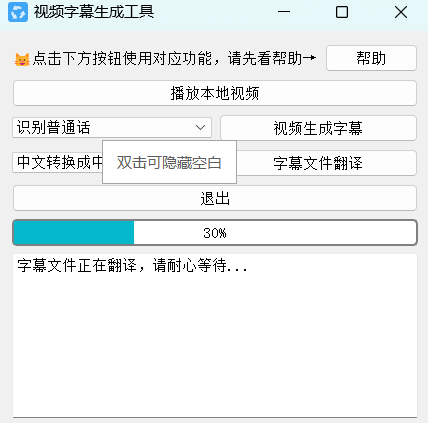

# 视频生成字幕工具

基于百度语音识别和机器翻译开发的视频生成字幕工具。在第一次使用前，请前往 [百度云控制台](https://console.bce.baidu.com/) 创建语音技术和机器翻译应用，获取对应的 API 密钥，申请免费使用。

## 特性

- 附带 mpv 播放器，支持多种视频格式。
- 生成的字幕为srt格式，适合编辑精校修改。

## 主要界面

以下是应用的主要界面截图：

